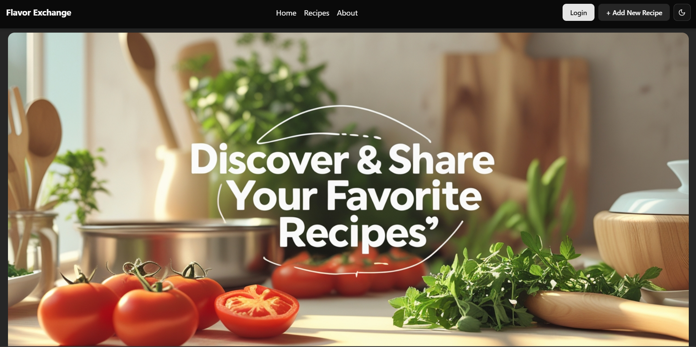

# Flavor Exchange 🍳

 <!-- Replace with actual banner path -->

A modern recipe-sharing platform built with React, TypeScript, and Tailwind CSS that lets users discover, save, and share culinary creations.

## ✨ Features

### Recipe Management
- 📝 Create, edit, and delete recipes
- 🖼️ Upload recipe images via URL
- 📋 Detailed view with ingredients and step-by-step instructions

### User Experience
- 🔍 Search by title or ingredients
- 🏷️ Filter by dietary restrictions (vegetarian, gluten-free, etc.)
- 💖 Save favorites with local storage persistence
- 🌗 Light/dark mode toggle

### Bonus Features
- ⏱️ Built-in cooking timer
- 📱 Fully responsive design
- 📤 Social media sharing

## 🚀 Tech Stack

| Category           | Technologies                          |
|--------------------|---------------------------------------|
| Core               | React 18, TypeScript                  |
| Routing            | React Router v6                       |
| State Management   | Zustand                               |
| Styling            | Tailwind CSS                          |
| Build Tool         | Vite                                  |
| Mock API           | JSON Server                           |
| Icons              | Lucide React                          |
| Utilities          | clsx, tailwind-merge                  |

## 🛠️ Installation

1. Clone the repository:
   ```bash
   git clone https://github.com/your-username/flavor-exchange.git
   cd flavor-exchange
